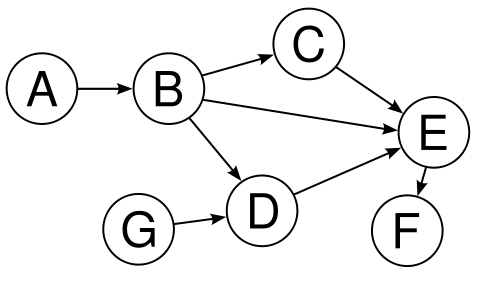
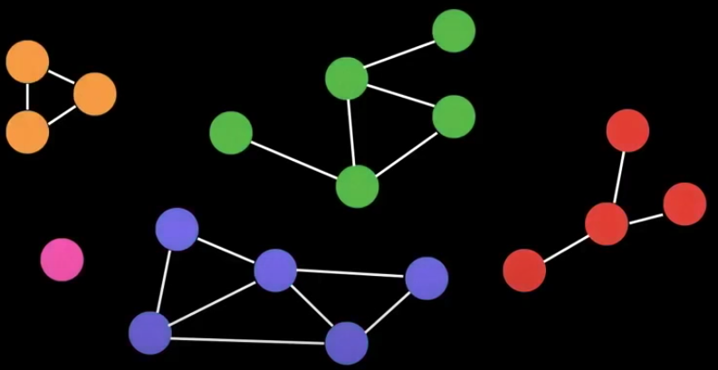
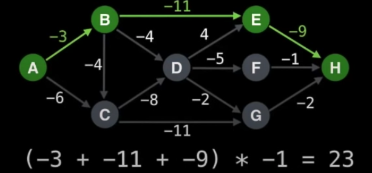

# Graph

# Definition

### Undirected Graph

An undirected graph is an graph in which **edges** have no orientation. The edge `(u,v)` is identical to the edge `(v,u)`.

### Directed Graph (Digraph)

This type of graph in which **edges** have orientations. For example `(u,v)` means from node `u` to node `v`.

### Weighted Graph

The edge in a graph can contain different weight to represent values like cost, distance... etc.

### Tree

A tree is a **undirected graph with no cycle**. This is a connected graph with n nodes and n-1 edges.

### Rooted Tree

A rooted tree is a graph with **a designated root** where every **edeg** either points away or towards to it. Edges point away from the root is called **out-tree**, and **in-tree** otherwise.

### Directed Acyclic Graph (DAG)

It means **a directed graph without cycles**. All out-trees are DAG but not all DAG are out-trees. This kind of graph is usually used in dealing with dependencies.

### Bipartite Graph

A graph is one whose vertices can be split into two groups U, V such that every edge connects between U and V.

Other definitions are "The graph is two colourable" or "no odd length cycle"

### Complete Graph

A complete graph is one where there is a edeg between every pair of nodes. A complete graph can be denoted as the graph kth.

# Graph Representation

### Adjacency Matrix

The cell `m[i][j]` represents the edge weight of going from node `i` to node `j`.

The edge going from a node to itself has cost of 0.

Pros

- space efficient for dense graphs.
- it takes `O(1)` time complexity to look up weights.
- simple to represent.

Cons

- the space complexity is `O(v^2)`
- it takes `O(v^2)` time complexity to traverse all edges.

### Adjacency List

A way to represent a graph as a map from nodes to lists of nodes.

Pros

- space efficient for sprase graphs.
- more efficient to traverse all edge comparing to `adjaceny matrix`

Cons

- it takes `O(E)` time complexity to look up weights.
- a bit more complex to represent.

### Edge List

A way to represent a graph with an unordered list of edges. Assume that a notation of triplet `(u,v,w)` means **the cost from node `u` to node `v` is `w`**

Pros

- space efficient for dense graphs.
- more efficient to traverse all edge comparing to `adjaceny matrix`
- simple to represent

Const

- it takes `O(E)` time complexity to look up weights.

# Common Problems

### The Shortest Path

Given a weighted graph, find the shortest path from node A to node B.

Algorithms

- BFS (unwieghted graph)
- Dijkstra
- Bellman-Ford
- Floyd-Warshall
- A-Star
- and many more...

### Connectivity

Does there exist a path from node A to node B?

Algorithms

- union find
- DFS
- or any search algorithms

### Negative cycles

A negative cycle is a infinite cycle in a weighted graph, which keeps producing negative cost, and hence it becomes an infinite cycle that cannot be escaped.

Negative cycles is not necessary bad. It can be used in trading currencies in a cycle `A -> B -> C -> A` to caculate the risk.

Algorithms

- Bellman-Ford
- Floyd-Warshall

### Strongly Connected Components (SCCs)

This means self-contained cycles within a directed graph where every vertex in a cycle can reach every other vertex in the same cycle.

Algorithms

- Tarjans
- Kosaraju

### Traveling Salesman Problem

Given a weighted graph, what is the shortest route that visits each node exactly once and returns to the origin node?

It's an NP-hard problem.

Algorithms

- Held-Karp
- branch and bound
- an many algorithms...

### Bridges

A bridge/cut edge is any edge in a graph whose removal increases the number of connected components.

Bridges can hint at weak points, bottlenecks and vulnerabilities in a graph.

### Articulation Points

Very similar to bridges but works on vertex instead of edges.

### Minimum Spanning Tree (MST)

A subset of the edges of a connected, weighted graph that connects all the vertices without any cycles and with the minimum possible total edge weight.

MSTs on a graph are not always unique.

It is useful in designing minimum cost network, transportation networks and so on.

Algorithms

- Kruskal
- Prim
- Boruvka

### Flow Network

With an infinite input source, how much flow can we push through the network? For example, assuming that edges represent how many cars the roads can sustain in traffic.

Algorithms

- Ford-fulkerson
- Edmonds-Karp
- Dinic

# Algorithms

### DFS

The time complexity is `O(Vertices + Edges)`

Mostyly used in

- count connected components (a graph is split into multiple parts)
- determine connectivity
- find bridge/articulation points

### BFS

the time complexity is `O(Vertices + Edges)`

Mostly used in

- shortest path on unweighted graphs.

### Topological Sort

It is mostly used in program build dependencies or finding the prerequisites. In this context, the ordering matters in a graph.

The time complexity is `O(Vertices + Edges)`

There are some caveats for Topological Sort:

- The result is not unique.
- It only works for DAG(Directed Acyclic Graph). A graph with cycle cannot have ordering.

(Prerequisites if we want to reach the node J.)

Steps for this algorithm

1. Pick an unvisited node
2. Do a DFS exploring the unvisited nodes.
3. On the callback of DFS, append the current node to an array.
4. Reverse the array to make it presenet in the Topological Sort.

### The Shortest/Longest Problems

The **Single Source Shortest Path** (SSSP) can be solved efficiently on a DAG in time complexity `O(V+E)`. It can be done with Topological Sort.

For the longest path, on general graph, it is a NP-Hard problem, but on DAG, it is `O(V+E)`.

Procedure

1. multiply all edges value by -1.
2. find the shortest path.
3. multiply all edges value by -1 again.

### Dijkstra

A Single Source Shortest Path (SSSP) algorithm for graphs with **non-negative edge weights**.

The time complexity is usually `O(E*log(V))`, depending on the data structure used.
