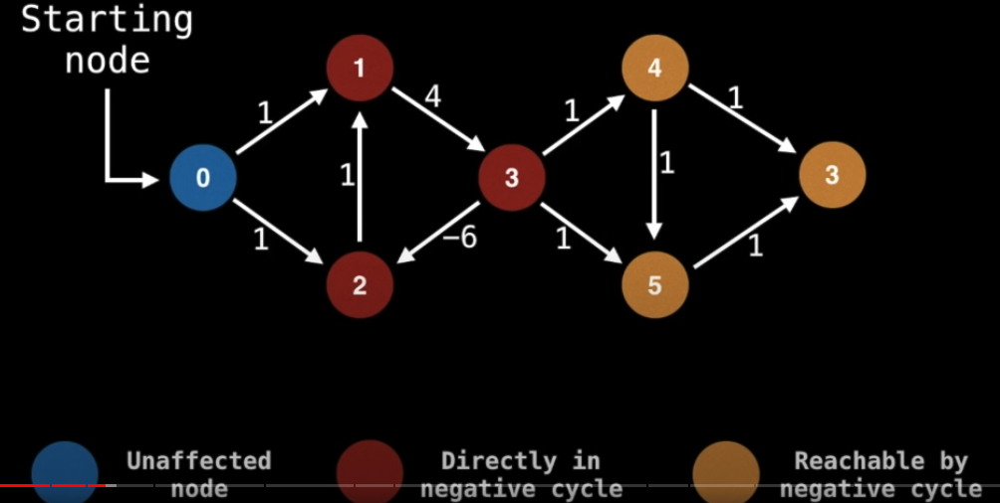
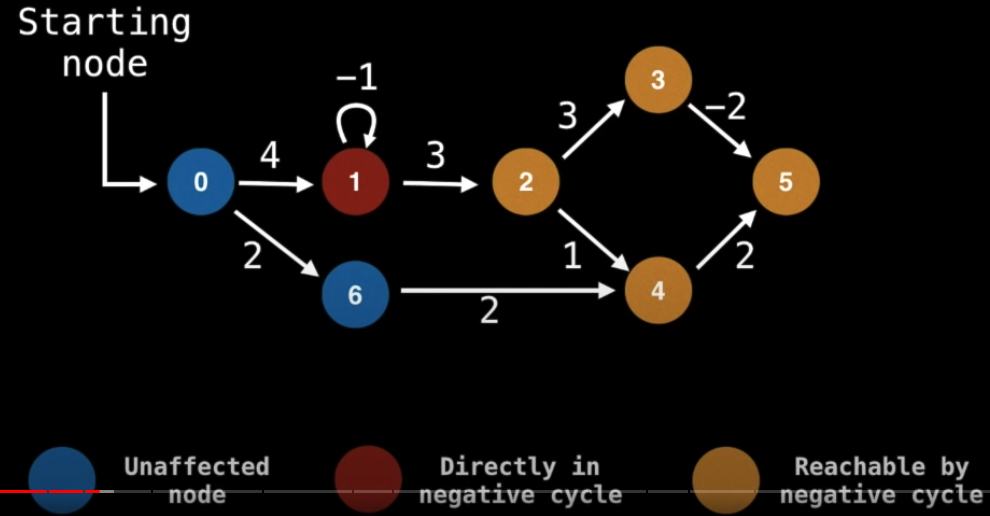
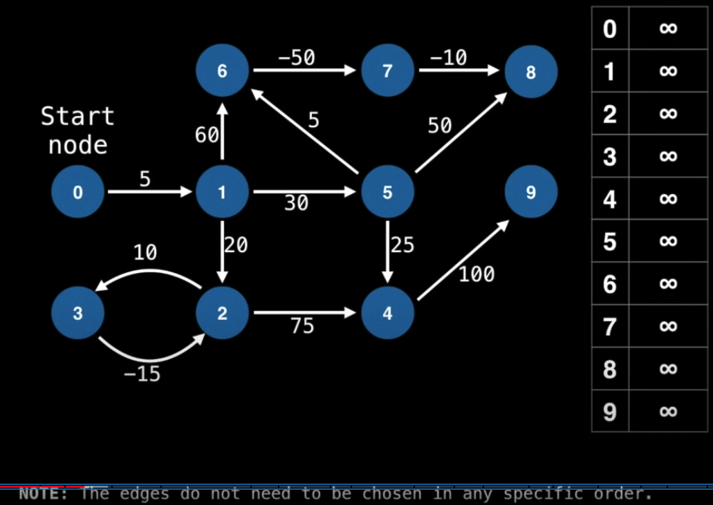
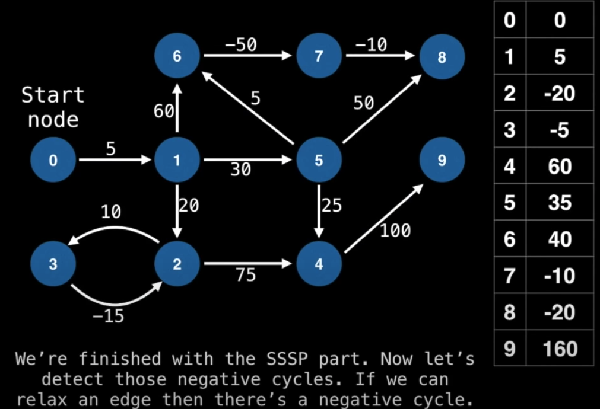
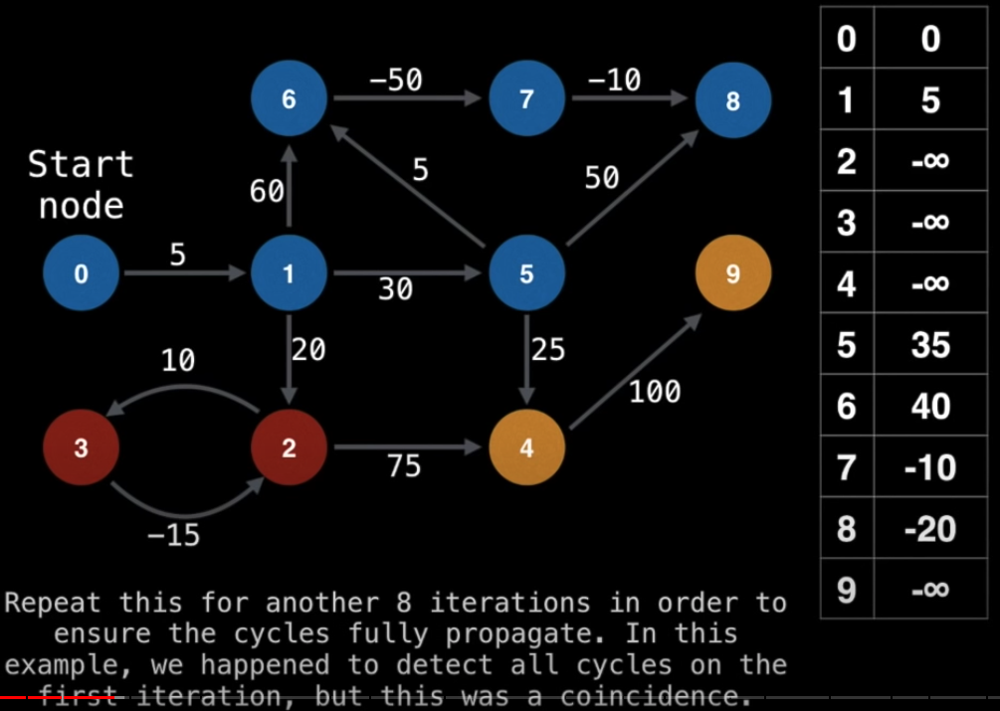

# Bellman-Ford

### Features

- A **Single Source Shortest Path (SSSP)** algorithm.
- Not ideal for most situations as the time complexity is `O(EV)`.
- Works on graphs with **negative cycles** and **determine where they occur**.

Useful in applications like **an arbitrage between two or more markets**.




### Procedures

- Let `E` be the number of edges.
- Let `V` be the number of vertices.
- Let `S` be the id of the starting node.
- Let `D` be an array of size V that tracks the best distance from S to each node.

[The animation of steps](https://youtu.be/09_LlHjoEiY?t=7012)

1. set every entry in `D` to postive infinity.



2. set `D[S] = 0`
3. relax (update `D` with a shorter path) each edge `V-1` times

```js
for(let i = 0; i < V - 1; i++) {
  for (let edge of graph.edges) {
    if (D[edge.from] + edge.cost < D[edge.to]>)
      D[edge.to] = D[edge.from] + edge.cost
  }
}
```



4. iterate each edge `V-1` times to find the negative cycle

```js
for(let i = 0; i < V - 1; i++) {
  for (let edge of graph.edges) {
    if (D[edge.from] + edge.cost < D[edge.to]>)
      D[edge.to] = Number.NEGATIVE_INFINITY
  }
}
```


