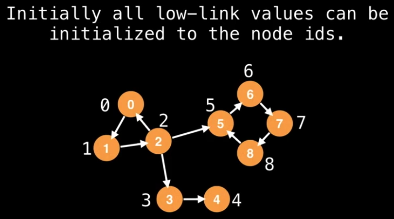
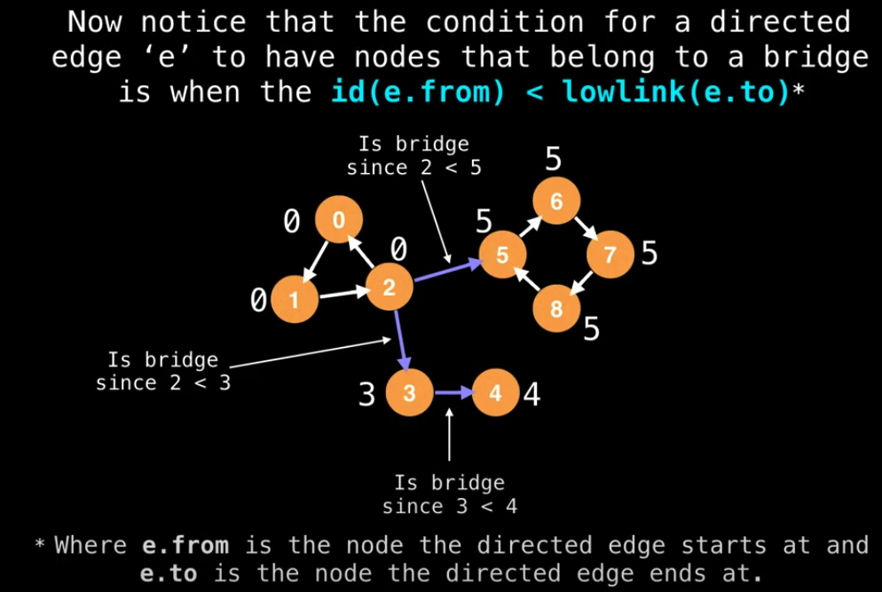
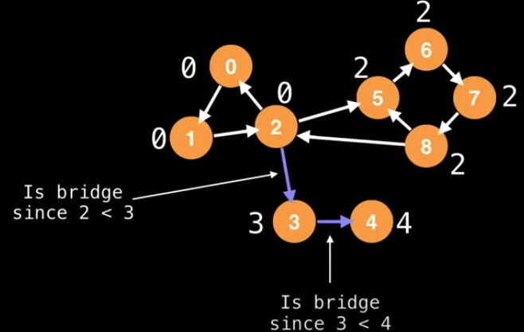
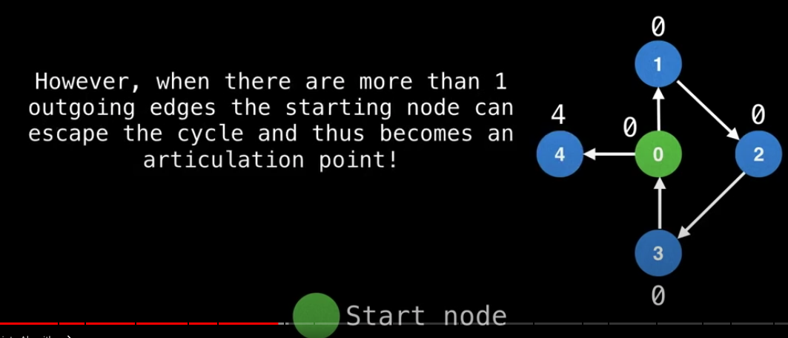

# Bridges

Time complexity is `O(V+E)`

### Procedure

Definitions

- `low-link` value of a node is defined as the smallest "lowest" id reachable from that node when doing a DFS (including itself.)

1. Do a DFS traversal (can start at any node)
2. Label nodes with an increasing id value
3. Track the id of each node and the smallest `low-link` value.
4. Bridges will be found where the id of the node your edge is coming from is less than the `low-link` value of the node your edge is going to.





# Articulation Points

### Procedure

The procedure of finding articulation points is much the same like how we work on bridges, the only difference is articulation points mostly obey the statement below instead

```
id(e.from) == lowlink(e.to)
```

The only time the statement fails is when the starting node has 0 or 1 outward directed edges. This implies the node is either a singleton(0 case) or the node is trapped in a cycle (1 case).


