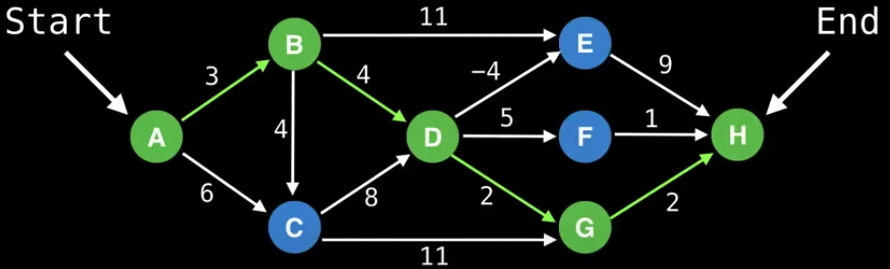
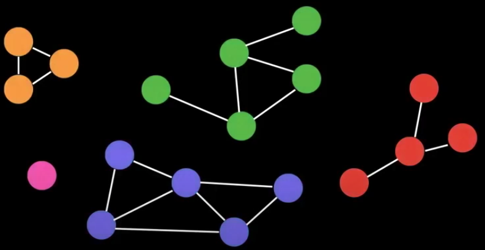
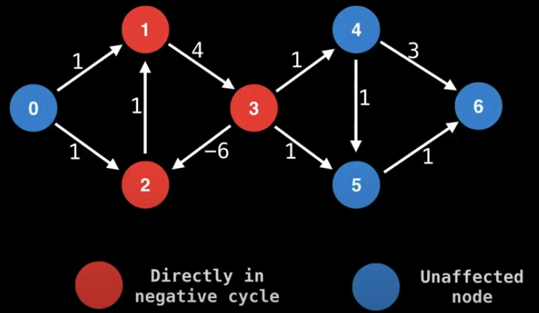
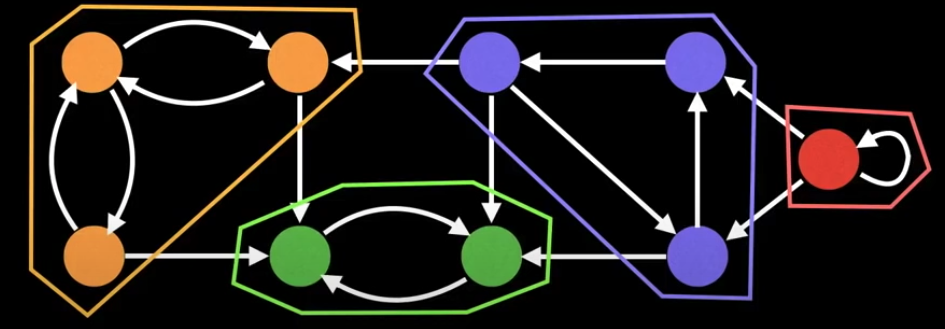
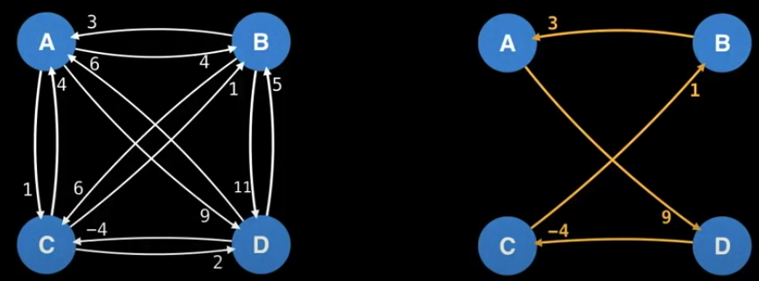
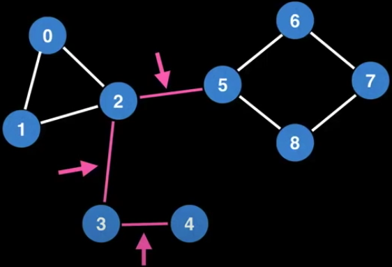
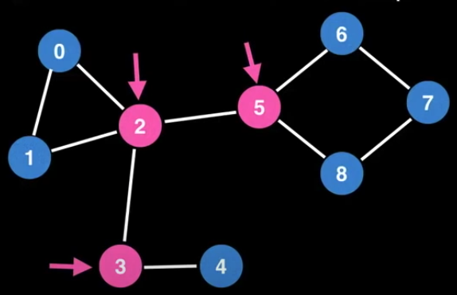
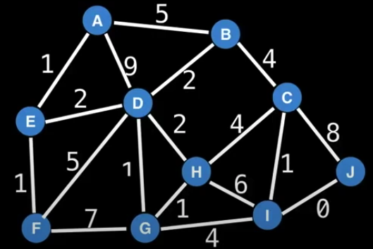
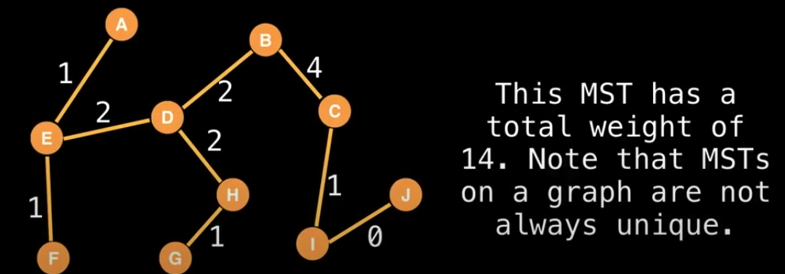
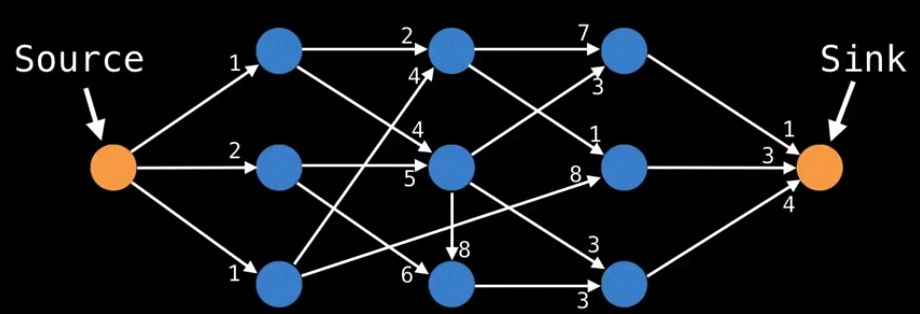

# Common Problems

### The Shortest Path

Given a weighted graph, find the shortest path from node A to node B.

Algorithms

- BFS (unwieghted graph)
- Dijkstra
- Bellman-Ford
- Floyd-Warshall
- A-Star
- and many more...

### Connectivity

Does there exist a path from node A to node B?

Algorithms

- union find
- DFS
- or any search algorithms

### Negative cycles

A negative cycle is a infinite cycle in a weighted graph, which keeps producing negative cost, and hence it becomes an infinite cycle that cannot be escaped.

Negative cycles is not necessary bad. It can be used in trading currencies in a cycle `A -> B -> C -> A` to caculate the risk.

Algorithms

- Bellman-Ford
- Floyd-Warshall

### Strongly Connected Components (SCCs)

This means self-contained cycles within a directed graph where every vertex in a cycle can reach every other vertex in the same cycle.

Algorithms

- Tarjans
- Kosaraju

### Traveling Salesman Problem

Given a weighted graph, what is the shortest route that visits each node exactly once and returns to the origin node?

It's an NP-hard problem.

Algorithms

- Held-Karp
- branch and bound
- an many algorithms...

### Bridges

A bridge/cut edge is any edge in a graph whose removal increases the number of connected components.

Bridges can hint at weak points, bottlenecks and vulnerabilities in a graph.

### Articulation Points

Very similar to bridges but works on vertex instead of edges.

### Minimum Spanning Tree (MST)

A subset of the edges of a connected, weighted graph that connects all the vertices without any cycles and with the minimum possible total edge weight.

MSTs on a graph are not always unique.

It is useful in designing minimum cost network, transportation networks and so on.

Algorithms

- Kruskal
- Prim
- Boruvka

### Flow Network

With an infinite input source, how much flow can we push through the network? For example, assuming that edges represent how many cars the roads can sustain in traffic.

Algorithms

- Ford-fulkerson
- Edmonds-Karp
- Dinic

