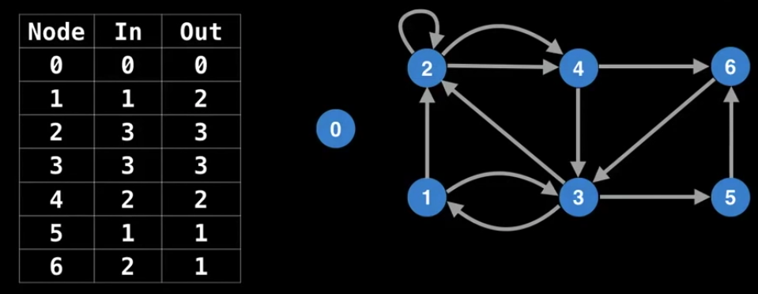

# Existence of Eulerian Path/Circuit

### Eulerian Path

An Eulerian Path (or Eulerian Trail) is a path of edges that visits all the edges in a graph exactly once.

### Eulerian Circuit

An Eulerian Circuit (or Eulerian cycle) is an Eulerian path which starts and ends on the same vertex.

### Node Degrees

### The Requried Conditions For A Valid Eulerian Path Circuit

Caveats

- A graph with an Eulerian Circuit will also have an Eulerian Path.
  
- All vertices with non-zero degree need to belong to a single connected component.
  

### Other Examples

### Procedure

In this algorithm, we will only cover Eulerian circuit. Remember that - if a graph has an Eurlerian circuit then it must also have an Eulerian path.

The time complexity is `O(E)`

[The animation for the procedure](https://youtu.be/09_LlHjoEiY?t=14550)

1. Count all the in/out degrees for a graph.
   
2. Find and choose the start node.
   
3. Use DFS and callback for backtracking the path. Keep tracking the out-degree and reduce the count of out-degree once we have a node visited.
   
