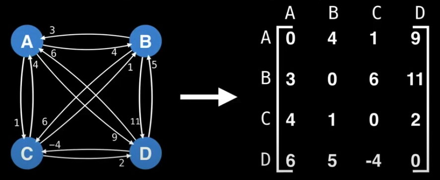
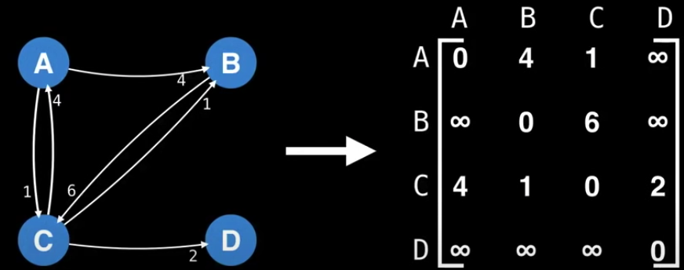
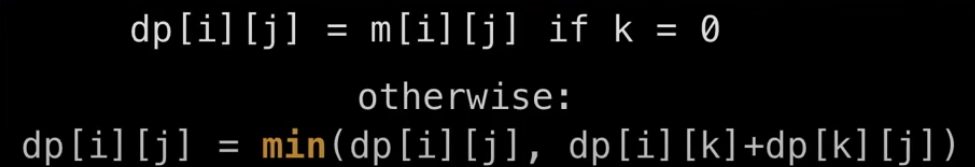

# Floyd-Warshall

Features

- It finds **All-Pairs Shortest Path (APSP)** (the shortest path between all paris of nodes.)
- Only ideal for graphs no larger than hundreds of nodes.

The time complexity is `O(V^3)`.

### Procuedures

1. Set up the graph with an adjacency matrix.

2. If there is no edge from node `i` to `j` then set the edge value to postive infinity.

3. Using dynamic programming to calculate all optimal paths for every nodes.

4. Rerun the algorithm to detect negative cycles and labeling them with negative infinity.
