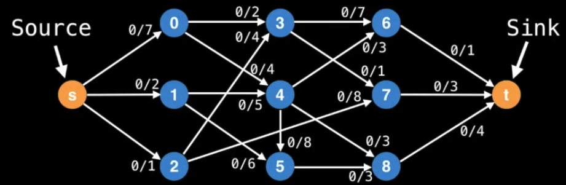
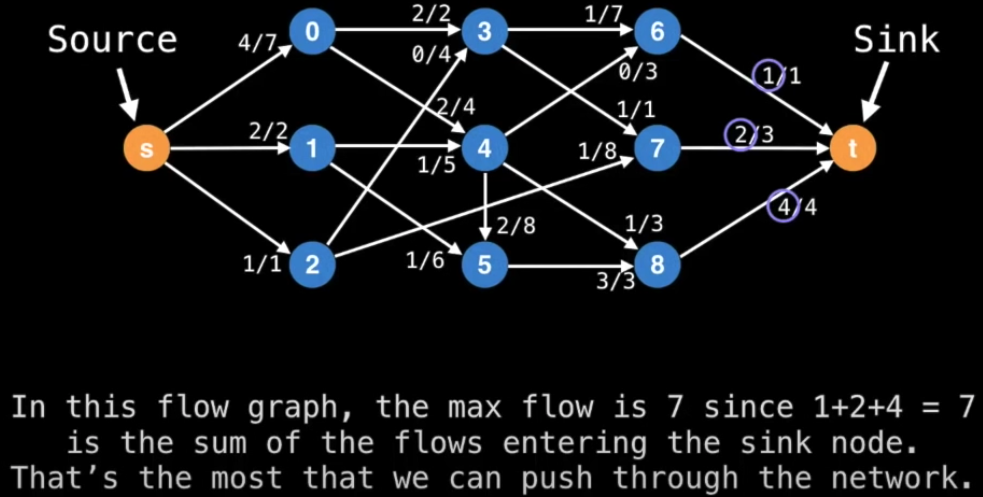
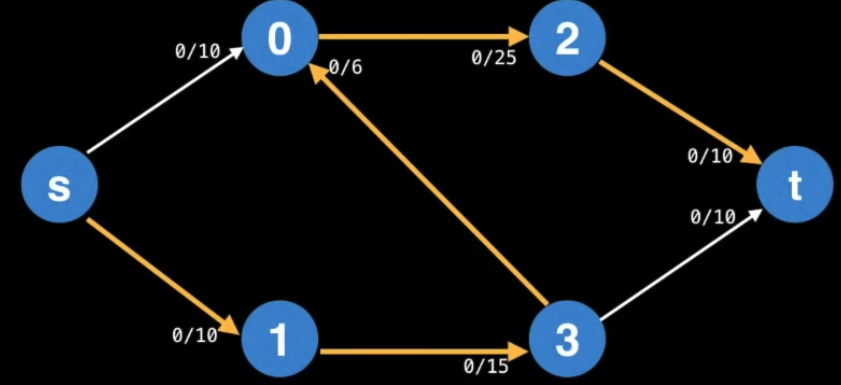
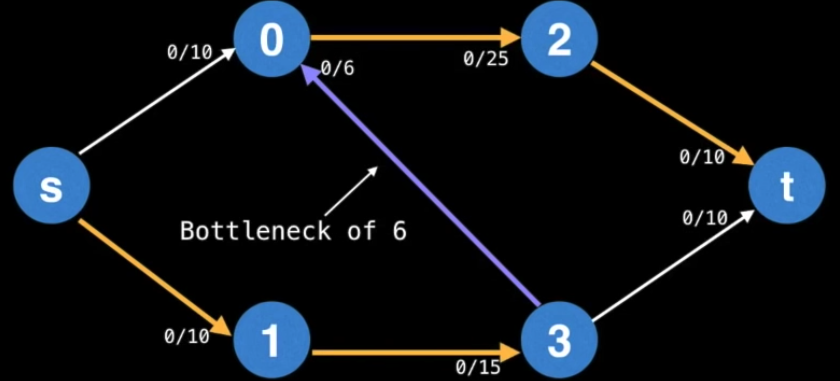
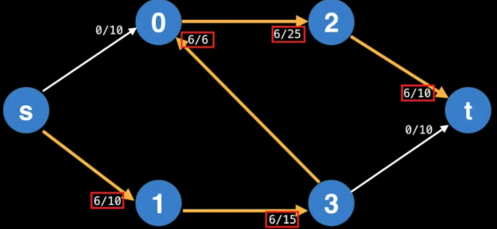
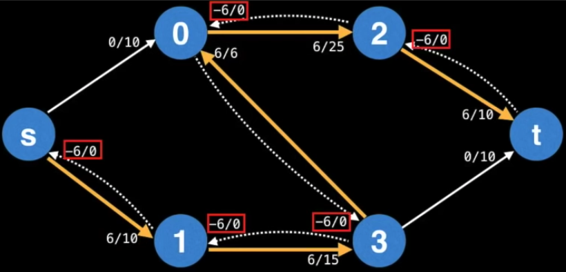
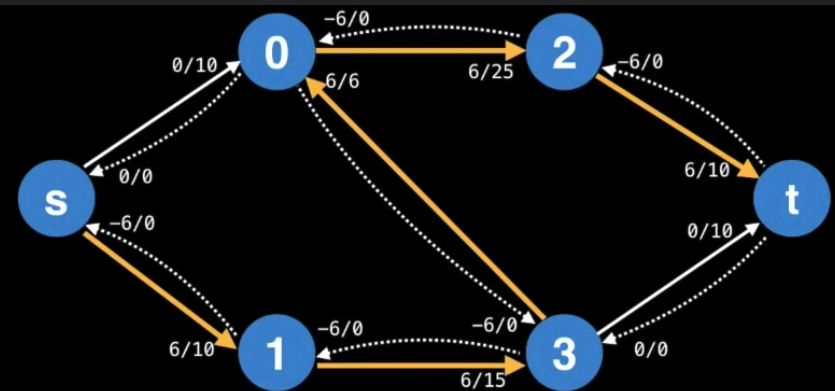
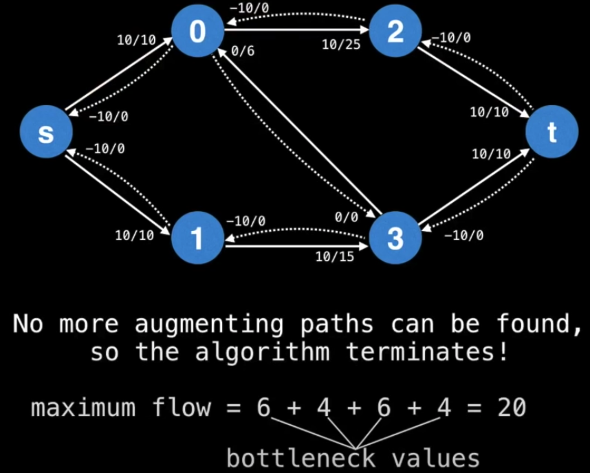
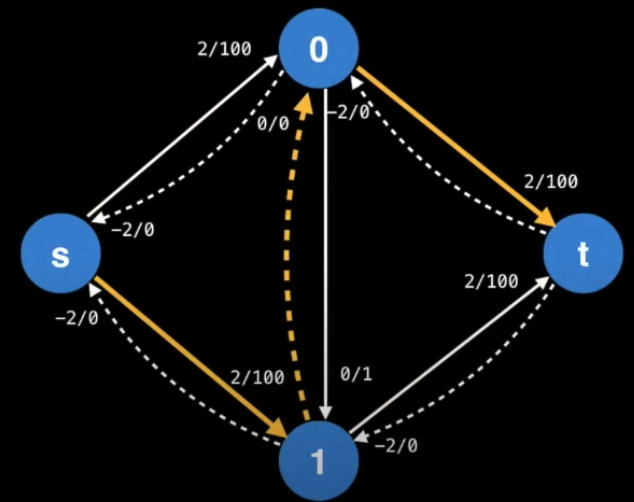

# Ford Fulkerson

### Max Flow

With an infinite input source, how much flow can we push through the network give that each node edge has a certain capacity?

### Terminologies

**An augmenting path** is a path of edges in the resdiual graph with unused capacity greater than 0 from the source `s` to the sink `t`

**A bottleneck** is the smallest edge on the path. We can use the bottleneck value to augment the flow.

**Augmenting the flow** means updating the flow values of the edges along the augmenting path. For forward edges, this means increasing the flow by the bottleneck value.

When augmenting the flow along the augmenting path, we also need to decrease the flow along each **residual edge** by the bottleneck value.

**Residual edges** exist to undo bad augmenting paths which do not lead to a maximum flow.

The **residual graph** is the graph which contains residual edges. This can be thought as the original graph as having a residual edge with a `flow/capacity` of `0/0` which is not shown.

### The Algorithm

To find the maximum flow (and min-cut as a by-product), we can use Ford Fulkerson to find the **augmenting paths** through the **residual graph** and augment the flow until no more augment paths can be found.

The key realization is the sum of the bottlenecks found in each augmenting path is equal to the max-flow.

[The procedure animation portal](https://youtu.be/09_LlHjoEiY?t=18154)

### Caveats

The time complexity is unspecified as this depends on the method being used to find the augmenting paths.

Suppose we are using DFS to find the augmenting paths, the time complexity will be `O(fE)`, where `f` is the maximum flow and `E` is the number of edges.

Since the DFS choose the next edge randomly, it could result in flipping back and forth between the same two alternating paths for 200 iterations.

### Other Algoirthms

- `Edmonds-Karp` time complexity `O(E^2V)`
- `Capacity scaling` time complexity `O(E^2log(U))`
- `Dinic` time complexity `O(V^2E)`
- `Push Relabel` time complexity `O(V^2E)` or `O(V^2sqrt(E))`
