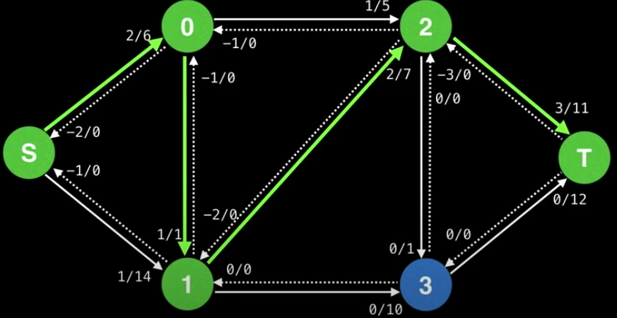

# Capacity Scaling

Again, the DFS approach to the max flow problem is, it chooses the next edge blindly, which could result really bad time complexity.

In the example below, suppose we have a max capacity edge with 1, if the DFS choose it as the next move, it will make the time complexity in the worst case.

### The algorithm

[The animation portal](https://youtu.be/09_LlHjoEiY?t=22511)

Capacity scaling is an idea that we should prioritize taking edges with larger capacities to avoid ending up with a path that has a small bottlenexk.

Definitions

- `U` the value of the largest edge capacity in the initial flow graph.
- `D` the largest power of 2 less than or equal to `U`

The algoithm takes edges whose reamining capacity is `E.capacity >= D` until no more paths satisfy this criteria, and then decreases the value of `D` by dividing it by 2 `D = D / 2` and repeat while `D > 0`.

This algorithm is still better than pure the DFS in practice.
