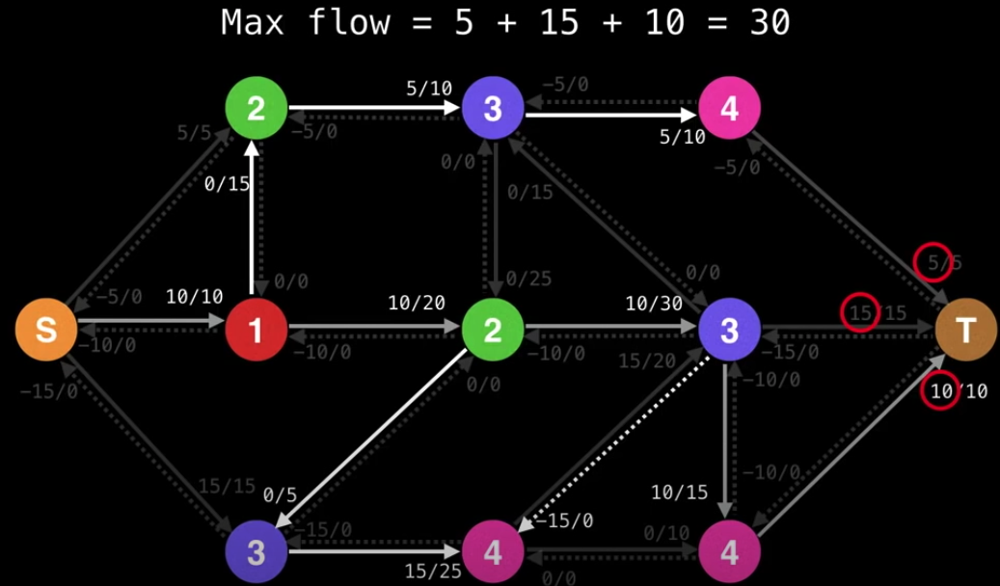

# Dinic

This algorithm is a combinations of the BFS and the DFS.

This is done by building levels of the graph with the BFS first, and we prioritize the move with edges that has `L+1` level. we can only makea **detour** to sideways (colored in gray in the picture below) when the edge with `L+1` level is full of capacity.

The dotted edges can also be made part of the level graph, but their remaining capacity has to be greater than 0.

### Procedure

[The animation portal](https://youtu.be/09_LlHjoEiY?t=23407)

1. Using a BFS to construct a level graph.
2. If the sink was never reached while building the level graph, then stop and return the max flow.
3. Using only valid edges in the level graph, do multiple DFSs from `s` to `t` until a **blocking flow** is reached, and sum over the bottleneck values.
4. Repeat steps 1 to 3.

The 1st iteration

The 2nd oteration (by building an new level graph)

Whenever we reach a dead end, backtrack and keep going until we reach the sink.

The final result (maflow = 5 + 15 + 10 = 30)

Since the dead end could be reached multiple time during DFSs, it can be further optimized by pruning dead ends when backtracking during the DFS phase.
