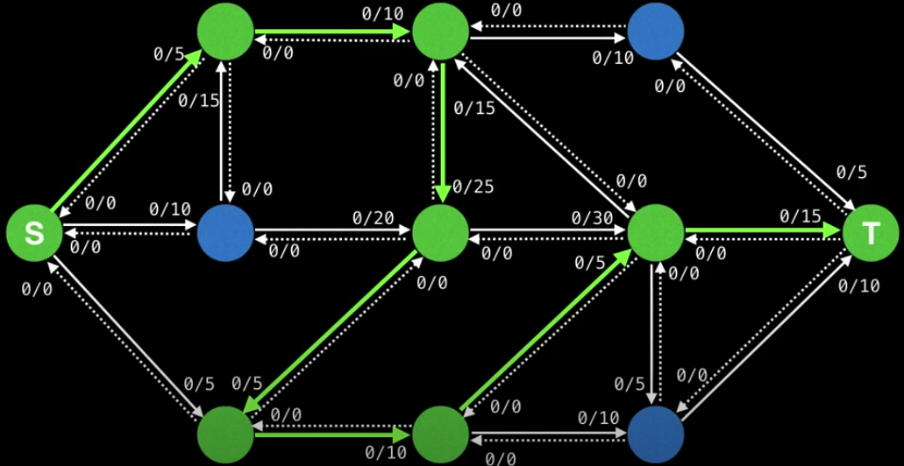
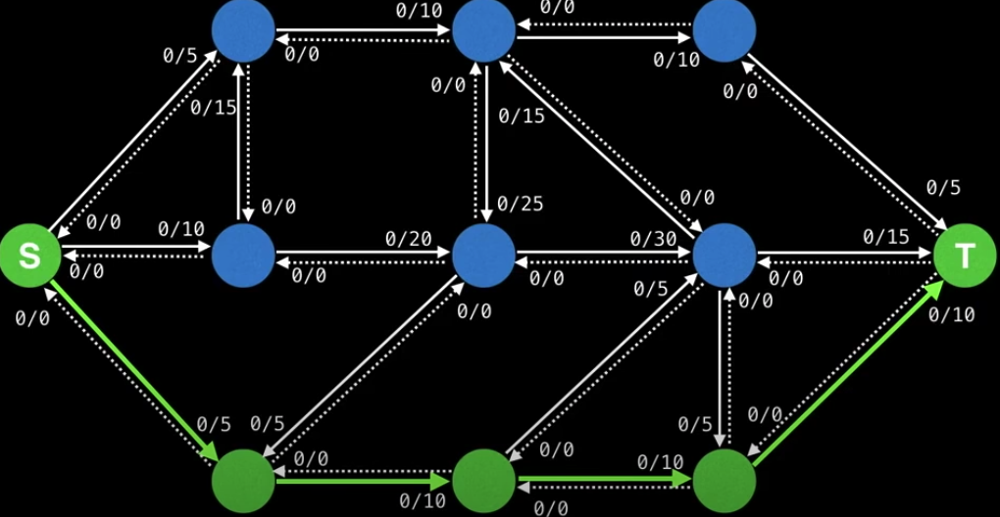
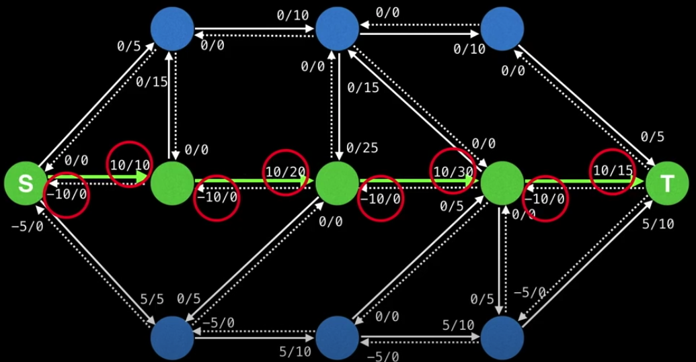
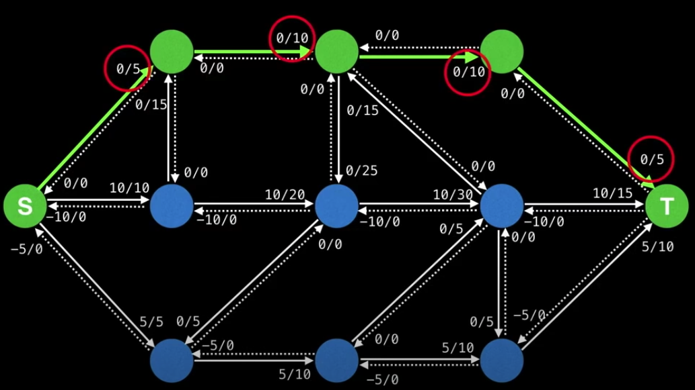

# Edmonds-Karp

In contrast to Ford-Fulkerson's approach to finding the max flow by using a DFS (`O(Ef)` where `E` is the number of edges), Edmonds-Karp uses a BFS to find augmenting paths which yields a better time complexity `O(VE^2)`.

The advantage of Edmonds-Karp is that the time complexity doesn't depend on the capacity value of any edge, and with this algorithm, we can find **the shortest augmneting path**.

The downside of the DFS is that a DFS chooses the next edge randomly, which could result longer path and worsen the time complexity in general.

This is how the BFS results when it adds all reachable edges to the queue and proceed.

[The animation portal](https://youtu.be/09_LlHjoEiY?t=21660)

Iteration 1

Iteration 2

Iteration 3

The result. The max flow from running Edmonds-Karp is the sum of the bottleneck values: `5 + 10 + 5 = 20`
