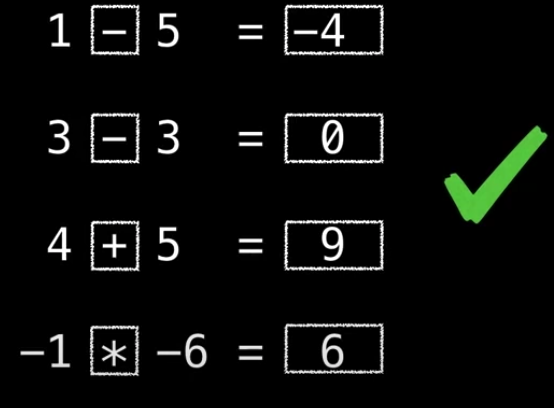
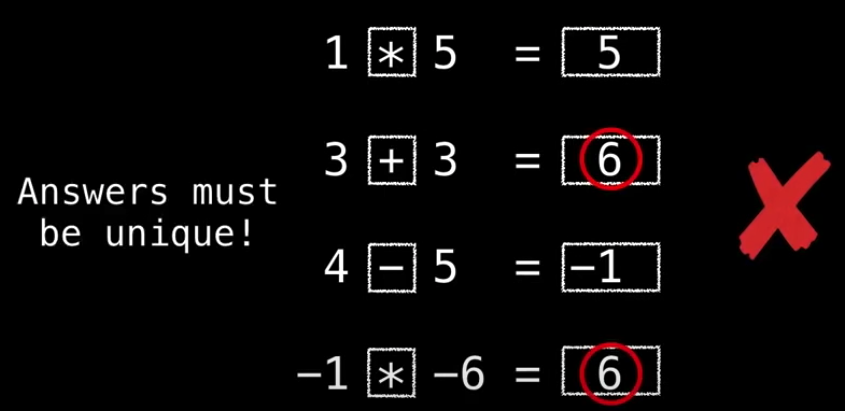
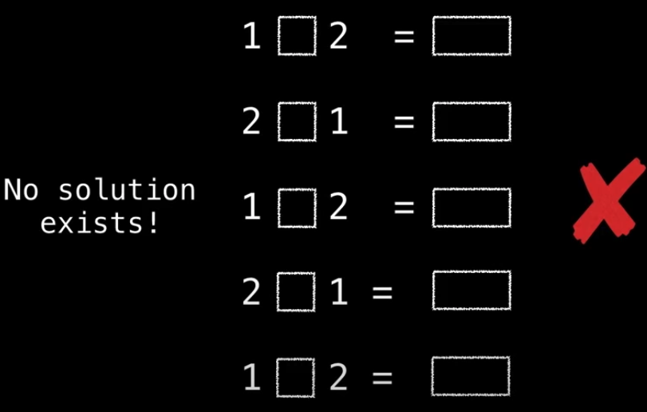
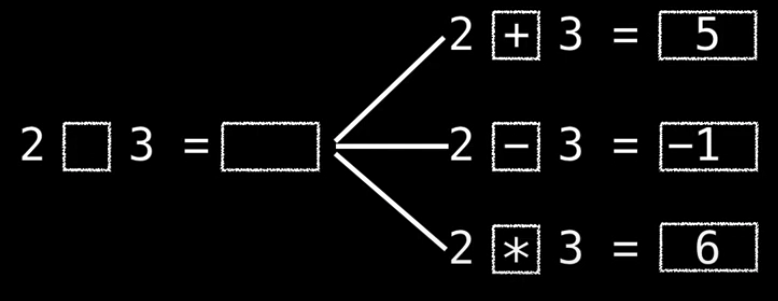
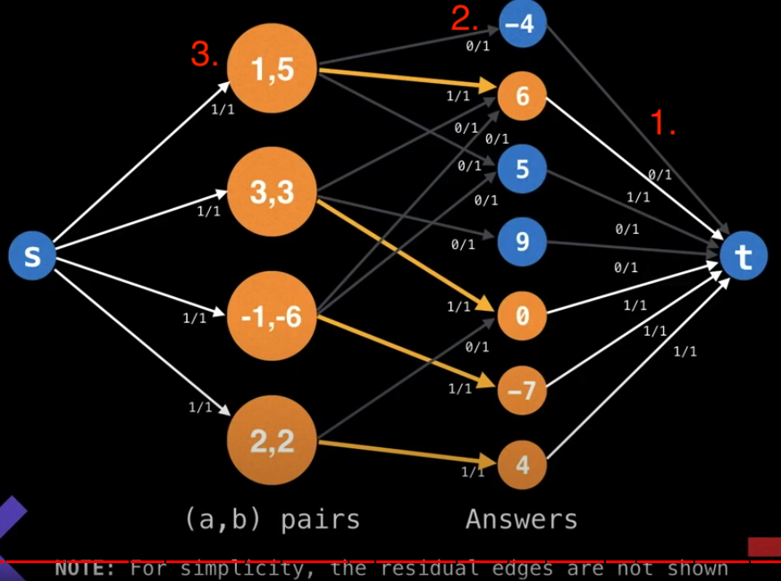
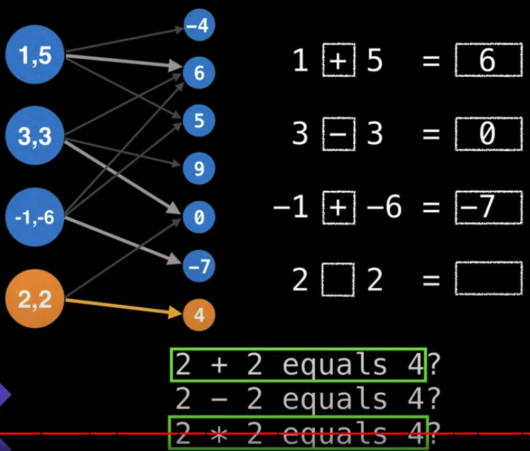

# Elementary Math

[problem portal](https://open.kattis.com/problems/elementarymath)

Ellen is a math teacher who is preparing `n` (1 <= n <= 2500) questions for a math exam. In each question, the students have to use operators `+`, `-` and `*` on a pair ofnumbers.

Ellen has already chosen the `n` pairs of numbers. Students can use these three operators (`+`,`-` and `*`) to perform calculations. Ellen wants to make sure tha the `n` correct answers to the exam are all different.

For each pair of numbers `(a, b)` in the same order as in the input, output a line containing a valid equation. Each equation should consist of five parts:

- `a`
- one of the three operators (`+`, `-` and `*`)
- `b`
- an eqauals sign (`=`)
- the result of the expression

All the `n` expression results must be different. If there are multiple valid answers, output any of them. If there is no valid answer, output a single line with the string "impossible" instead.

### Procedure

[Animation portal](https://youtu.be/09_LlHjoEiY?t=21112)

Key realization: For every pair, at most three unique solutions are produced.

In the graph abobe, `(1,5)` pair with three oeprators can produce answers:

- `1 - 5 = -4`
- `1 + 5 = 6`
- `1 * 5 = 5`

so does `3 + 3 = 6`, so the answer should not be duplicated.

The number labels are explain in detailed as below:

1. The capacity is set to 1 as the answer has to be unique.
2. The capacity is set to 1 as only one of `+`, `-` or `*` can be matched with an answer.
3. The capacity is set to 1 as the number represents the **frequency of the input pair**. In this example, all frequencies are 1, but it isn't always the case.

Here with the graph, we can deduce the operator used for each matching by trying which of `(+,-,*)` results in the answer matched the one on the right.

