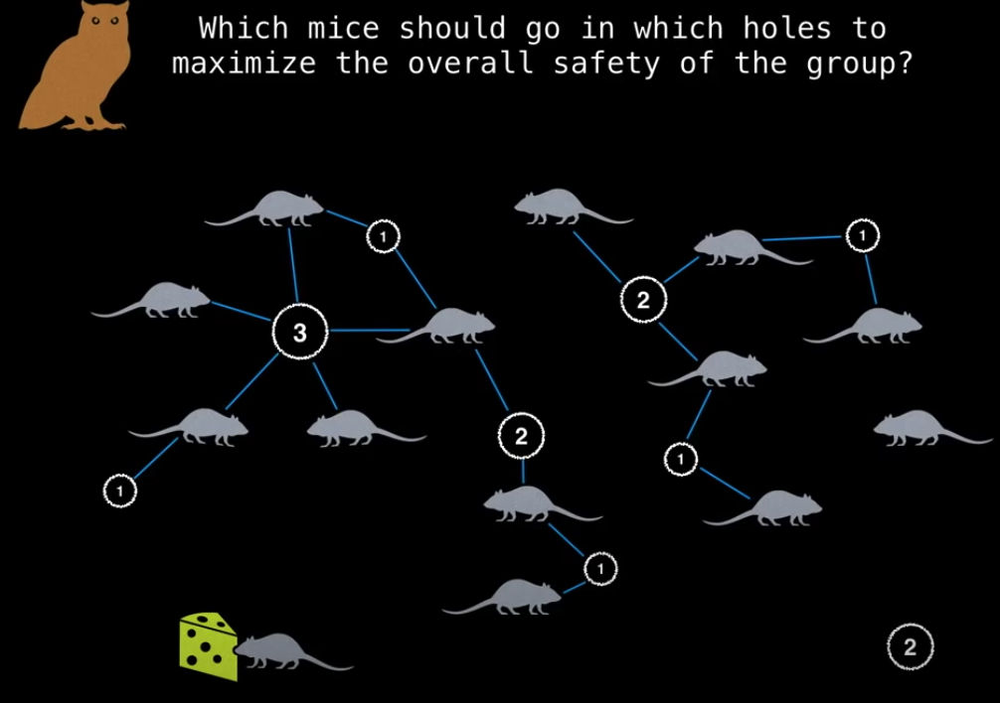

# Mice and Owls

Suppose we have owls and mice. Owls want to hunt down those mice, however , there are several holes as hideouts which can prevent mice from getting caught.

This can be illustrated as a bipartite graph.

Which mice should go in which holes to maximize the overall safety of the group?

The problem is now a maximum flow problem.

