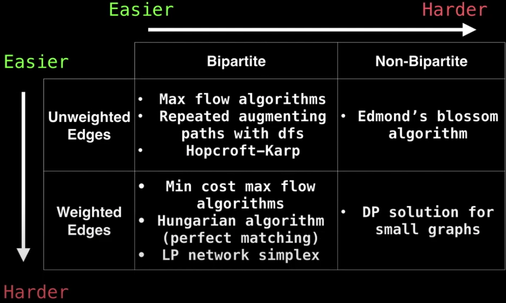

# Unweighted Bipartite

### What is a Bipartite?

A Bipartite graph is one whose vertices can be split into two independent groups U and V such that every edge connects between U and V.

It is also known as **two colourable** or **no cycle with an odd length**.

### Maximum Cardinality Matching

**Maximum Cardinality Bipartite Matching (MCBM)** - we have maximized the pairs that can be matched with each other.

Applications

- matching candidates for jobs
- chairs to desks
- surfers to surf boards
- members of two groups should be matched in paris...

### Common matching variations

### The algorithm

[Animation portal](https://youtu.be/09_LlHjoEiY?t=20022)

Assuming we have 5 people that want to borrow books from the library, how do we find the best match result?

We can try the greedy approach, but it will have people left empty-handed. (The 4th person has no book.)

The problem can be turned into a network flow and be solved with unweighted bipartite.

With unweighted bipartite, everyone gets a book of which he/she desired.

We can change the capacity of each person to adjust how many book a person can borrow.

We can also change how many copies of the book are there for borrow.

What if we allow each person to borrow the same kind of book multiple times as long as there are enough copies? This can be done by so.

