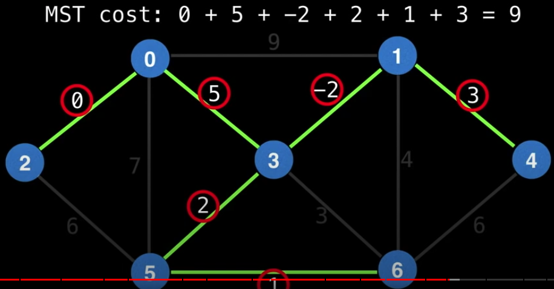
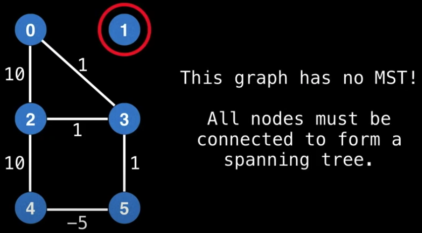
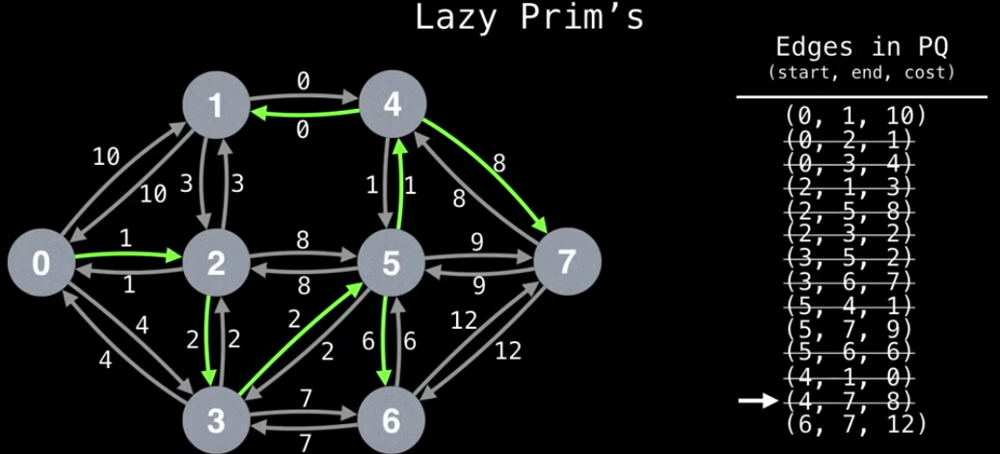
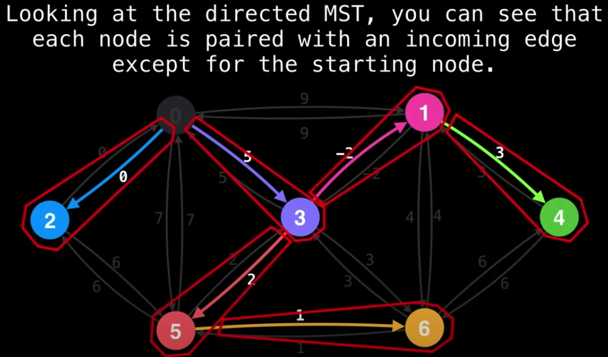
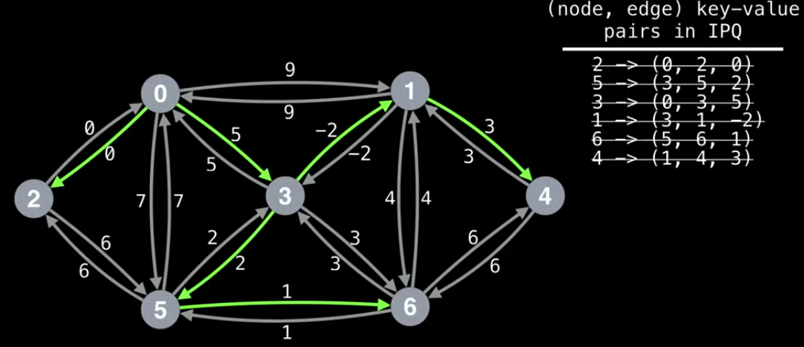

# Prim's Minimum Spanning Tree

### Minimum Spanning Tree (MST)

Given an undirected weighted graph, a subset of the edges in the graph which connects all vertices together (without cycle) while minimizing the total edge cost.

Caveats

- The MST might not be unique in a graph.
- The graph has to be a single component.

### Prim's MST

Prims's is a greedy MST algorithm for dense graphs, however this doesn't do well on finding **minimum spanning forest**(MST for multiple connected components)

The time complexity of the lazy version of Prims is `O(E*log(E))`.
The time complexity of the eager version of Prims is `O(E*log(V))`.

### Lazy Version

1. Maintain a min PQ that sorts edges based on min edge cost. It will be used for determine the next node to visit.
2. Start on any node. Enqueue it to the PQ and mark it as visited.
3. While the PQ is not empty and the MST has not been formed, dequeue the next cheapeast unvisited dege, mark it as visited and add it to the MST.
4. Iterate over the new node's edges and enqueue all the unvisited edeges to the PQ.

[The procedure animation portal](https://youtu.be/09_LlHjoEiY?t=16072)

### Eager Version

In the lazy version of Prim's MST, our PQ sometimes has nodes with stale state. The eager version of Prim's tracks **`(node, edge)` key-value pairs** that can be easily be **updated** and **polled**.

Key realizations

- Each node is paird with **exactly one** of its incoming edges (except for the start node)
- We update the PQ instead of enqueuing edges.
- Use **indexed priority queue** (IPQ) instead to update and poll more efficiently.

1. Maintain a min IPQ of size `v` that sorts vertex-edge pairs `(v, e)` based on the min edge cost of `e`. By default, all vertices `v` have a best value of `(v, null)` in the IPQ.
2. Start on any node `S`. Mark `S` as visited and update all edges of `s`.
3. While the IPQ is not empty and the MST has not been formed, dequeue the next best pair `(v, e)`. Mark node `v` as visited and add edge `e` to the MST.
4. Update all edges of `v` and make sure not updating any edge pointing to a visited node.

[The procedure animation portal](https://youtu.be/09_LlHjoEiY?t=16906)

