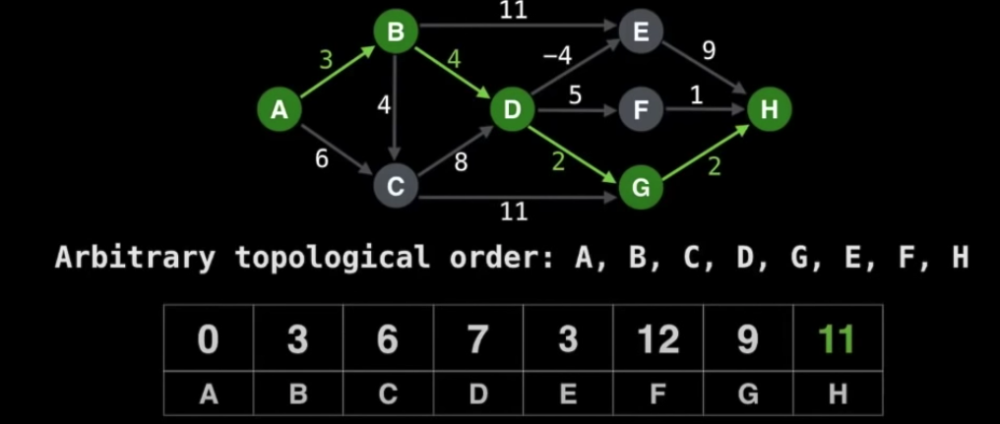
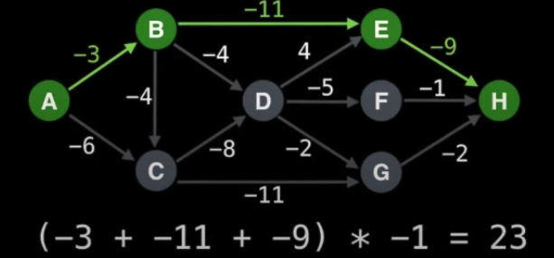

# The Shortest/Longest Problems

The **Single Source Shortest Path** (SSSP) can be solved efficiently on a DAG in time complexity `O(V+E)`. It can be done with Topological Sort.

For the longest path, on general graph, it is a NP-Hard problem, but on DAG, it is `O(V+E)`.

### Procedures

1. multiply all edges value by -1.
2. find the shortest path.
3. multiply all edges value by -1 again.

