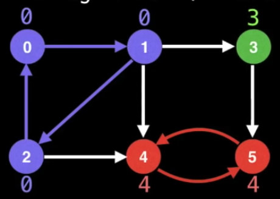
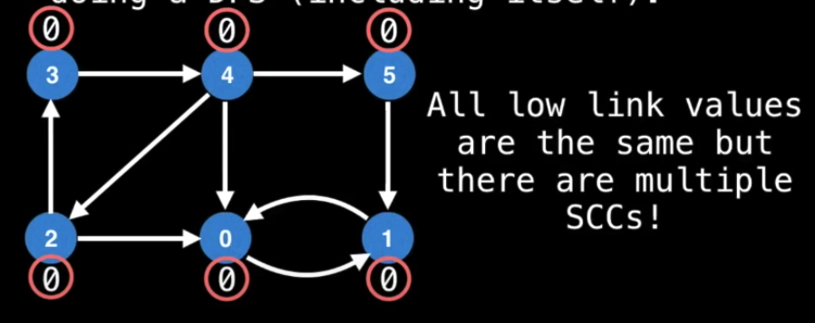

# Tarjan

A specific algorithm for finding the strongly connected components(SCC)

Definitions

- The `low-link` value of a node is the smallest (lowest) node id reachable from that node when doing a DFS(including itself).

We can use the `low-link` values and DFS to find the SCCs, however it depends on the starting node and the traversal order to make it work. If if starts at the wrong node, the result will not be expected.

This is where Tarjan kicks in. The Tarjan will maintain an invariant that prevents SCCs to interfere with each others' low-link values.

The time complexity is `O(V+E)`

### Procedures

1. Start DFS.
2. When visiting a node, assign it an `id` and a `low-link` value. Also push it to a visited stack.
3. On DFS callback, if the previous node is on the stack then `min` the current nodes' `low-link` value with the last node's low-link value.
4. After visiting all neighbours, if the current node started a connected component then pop nodes off stack until current node is reached.

[The animation of how Tarjan works](https://youtu.be/09_LlHjoEiY?t=11041)
