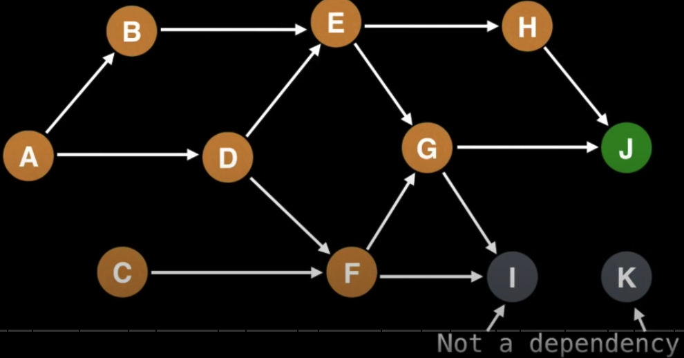

# Topological Sort

Features

- The result is not unique.
- It only works for DAG(Directed Acyclic Graph). A graph with cycle cannot have ordering.

It is mostly used in program build dependencies or finding the prerequisites. In this context, the ordering matters in a graph.

The time complexity is `O(Vertices + Edges)`

(Prerequisites if we want to reach the node J.)

### Procedures

1. Pick an unvisited node
2. Do a DFS exploring the unvisited nodes.
3. On the callback of DFS, append the current node to an array.
4. Reverse the array to make it presenet in the Topological Sort.
