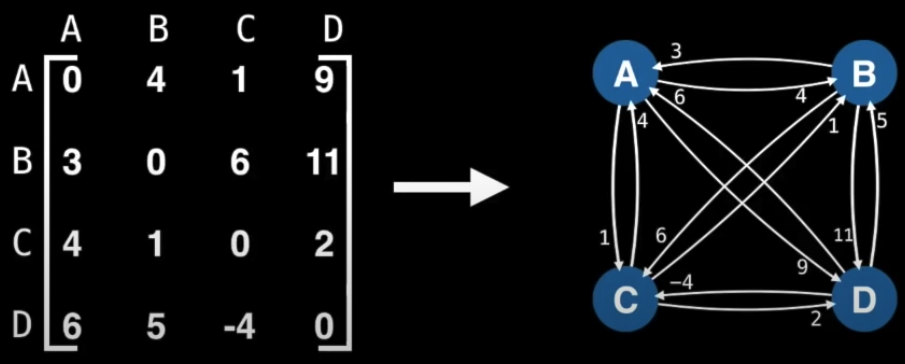
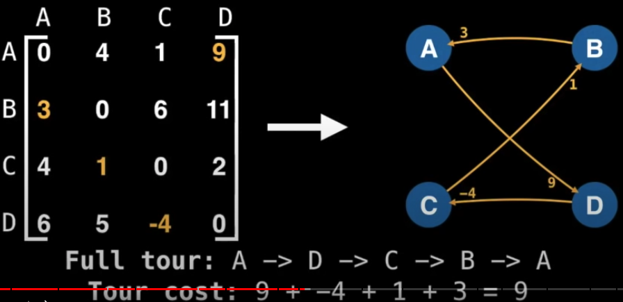
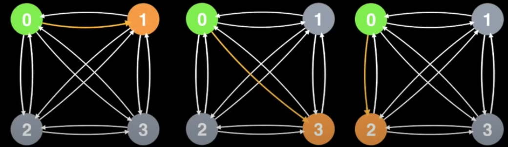
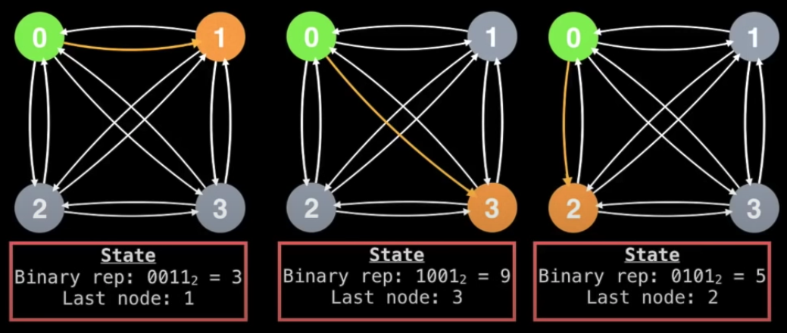
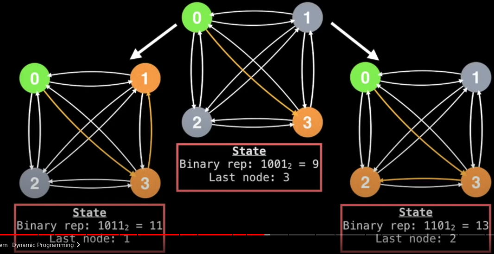

# Travelling Salesman Problem (TSP)

Given a **complete graph** (a graph in which every node have double directed edges to each other nodes) with weighted edges, what is the **Hanmiltonian cycle** (path that visits every node once of minimum cost)?

This is an NP-complete problem, as we have to compute all the premutations. The time complexity in general is `O(n!)`. Normally, we can handle this with dynamic programming to improve the time complexity.

### Procedure

1. Choose a node `S` as our start.
2. Compute and store the optimal value from `S` to each node `X`.
   
3. We can use a single 32-bit integer as our memo cache.
   
   
4. Loop until we find all the premutations and connect the path back to our start node `S`. The end state of our cache representation should be a binary composed of `N` 1's.
